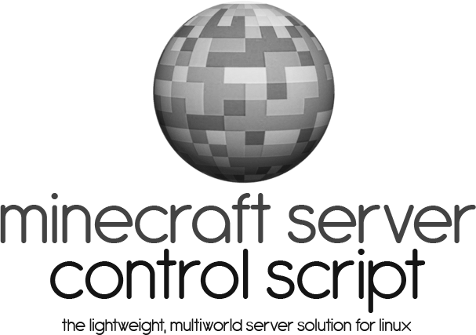

<p align="center">
  
</p>

# Index
* [Overview](#overview)
* [Prerequisites for installation](#prerequisites-for-installation)
  * [Required programs](#required-programs)
  * [Configuring the firewall / NAT](#configuring-the-firewall--nat)
  * [Mapping software](#mapping-software)
* [Installation](#installation)
  * [Downloading the script](#downloading-the-script)
  * [Configuration](#configuration)
  * [Updating MSCS](#updating-mscs)
* [Getting started guide](#getting-started-guide)
  * [Creating a new world](#creating-a-new-world)
  * [Importing an existing world](#importing-an-existing-world)
    * [Renaming a world](#renaming-a-world)
  * [Adjusting global server properties](#adjusting-global-server-properties)
    * [Default global server properties](#default-global-server-properties)
  * [Adjusting world properties](#adjusting-world-properties)
    * [Default world properties](#default-world-properties)
    * [Enabling Forge, BungeeCord, and other server software](#enabling-forge-bungeecord-and-other-server-software)
* [Performing backups and other tasks](#performing-backups-and-other-tasks)
  * [Scheduling backups](#scheduling-backups)
  * [Viewing and restoring backups](#viewing-and-restoring-backups)
  * [Removing backups after X days](#removing-backups-after-x-days)
  * [Scheduling restarts](#scheduling-restarts)
  * [Scheduling mapping](#scheduling-mapping)
* [Setting up mapping](#setting-up-mapping)
  * [Installing Overviewer (the mapping software)](#installing-overviewer-the-mapping-software)
  * [Configuring overviewer](#configuring-overviewer)
  * [Changing the default rendering settings](#changing-the-default-rendering-settings)
* [Command reference](#command-reference)
  * [Examples](#examples)
* [Issues](#issues)
  * [Troubleshooting](#troubleshooting)
* [Code of Conduct](CODE_OF_CONDUCT.md)
* [License](LICENSE)
* [Disclaimer](#disclaimer)

## Overview
**M**inecraft **S**erver **C**ontrol **S**cript (**MSCS**)
is a server-management script for UNIX and Linux powered Minecraft servers.

Features include:

* Run multiple Minecraft worlds.
* Start, stop, and restart single or multiple worlds.
* Create, delete, disable, and enable worlds.
* Includes support for additional server types: [Forge](http://www.minecraftforge.net/),
[BungeeCord](http://www.spigotmc.org/wiki/bungeecord/),
[SpigotMC](http://www.spigotmc.org/wiki/spigot/), etc.
* Users automatically notified of important server events.
* LSB and systemd compatible init script,
allows for seamless integration with your server's startup and shutdown
sequences.
* Map worlds using the [Minecraft Overviewer](http://overviewer.org/)
 mapping software.
* Automatically backup worlds, remove backups older than X days,
and restart worlds.
* Update the server and client software automatically.
* Send commands to a world server from the command line.

## Prerequisites for installation
Ensure that you have done the following before installing MSCS:

### Required Programs
We've made an attempt to utilize only features that are normally installed in
most Linux and UNIX environments in this script. However, there may be a few
requirements that this script has that may not already be in place:
* Java JRE                   - The Minecraft server software requires this. 
                               **As of Minecraft 1.12, Java 8 is required.**
* Perl                       - Most, if not all, Unix and Linux like systems
                               have this preinstalled.
* libjson-perl               - Allows the script to read JSON formatted data.
* libwww-perl                - Allows the script to download data to verify
                               downloads.
* liblwp-protocol-https-perl - Allows the script to download data over HTTPS.
* Python                     - Required by the Minecraft Overviewer mapping
                               software.
* GNU Make                   - Allows you to use the Makefile to simplify
                               installation.
* GNU Wget                   - Allows the script to download software updates
                               via the internet.
* rdiff-backup               - Allows the script to efficiently run backups.
* rsync                      - Allows the script to efficiently make copies of
                               files.
* Socat                      - Allows the script to communicate with the
                               Minecraft server.
* Iptables                   - Although not explicitly required, a good
                               firewall should be installed.

If you are running Debian or Ubuntu, you can make sure that these are
installed by running:

    sudo apt-get install default-jre perl libjson-perl libwww-perl liblwp-protocol-https-perl python make wget rdiff-backup rsync socat iptables

### Configuring the firewall / NAT
If you have a firewall installed on your computer, or a router using NAT
installed in your network, you will need to route some ports to your server.
Instructions on how to accomplish this are beyond the scope of this document,
but here are some things you will need to know:
* The default port for the Minecraft server is: `25565`.
* If you wish to run multiple world servers using this script, you may
  want to open a range of ports (for example `25565 - 25575`).
* If you are using [BungeeCord](http://www.spigotmc.org/wiki/bungeecord/),
  you will most likely need to only open the default port: `25565`.

See the [iptables.rules](iptables.rules) file for a very basic set of rules
that you can use with the Iptables firewall.

### Mapping software
The script uses the [Minecraft Overviewer](http://overviewer.org) mapping
software to generate maps of your worlds. Please see [Setting up mapping](#setting-up-mapping)
for installation and configuration instructions.

## Installation
### Downloading the script
The easiest way to download the script is to make a clone of the [git
repository](https://github.com/MinecraftServerControl/mscs.git).
You must have git installed first. To install git:

    sudo apt-get install git

Then:

    git clone https://github.com/MinecraftServerControl/mscs.git

Note that it will be downloaded into the current directory which you are
working in.

##### Other ways to download

* Get the latest stable 
[release](https://github.com/MinecraftServerControl/mscs/releases).

* Get the development version as a 
[zip file](https://github.com/MinecraftServerControl/mscs/archive/master.zip):

    wget https://github.com/MinecraftServerControl/mscs/archive/master.zip

### Configuration

Navigate to the `mscs` directory that you just downloaded.  Configuration can
be done with the included Makefile in Debian and Ubuntu like environments by
running:

    sudo make install

This will give the user you created in the config (by default, the user is
called `minecraft`) access to write in the `/opt/mscs` folder.

If you get a permission error, please see the 
[troubleshooting](#troubleshooting) section.

#### Manual Configuration
If you wish to configure the script manually, please visit the 
[wiki page](https://github.com/MinecraftServerControl/mscs/wiki/Manual-Configuration).

### Updating MSCS
Periodically Minecraft Server Control Script is updated to address bug fixes
and add new features. The easiest way to fetch the latest update, assuming you
used [the easiest way to install the script](#downloading-the-script), first
`cd` into the folder where you downloaded MSCS. Then, type:

    git pull

You can alternatively use [one of the other methods](#other-ways-to-download)
to download the latest version.  Just `cd` into the folder containing the MSCS
download to continue.

Once you have the latest version of MSCS downloaded, type:

    sudo make update

## Getting started guide
So you successfully installed the script--great!

At first, you probably want to [create a new world](#creating-a-new-world) or
[import an existing world](#importing-an-existing-world) into the script.

Then, you might want to adjust the
[world properties](#adjusting-world-properties), adjust the
[global server properties](#adjusting-global-server-properties), and enable any
other [server software](#enabling-forge-bungeecord-and-other-server-software)
as needed.

### Creating a new world
The command to create a new world is:

    mscs create [world] [port] <ip>

Where `world` is the name of the world you specify,
and `port` is the server port (by default, use `25565`).
`ip` is optional and will be used if you wish to bind a world server to a
specific network interface (e.g. `127.0.0.1` to enforce local access only).

Afterwards, start the server via `mscs start [world]` where `world` is the
name of the world. The world will then shut down because you have to accept
the EULA.

The EULA can be found in `/opt/mscs/worlds/myWorld` where `myWorld`
is the name given to the world you created.

After accepting the EULA simply start the server using the same command above,
and you're all set!

### Importing an existing world

If you wish to import or make a copy of an existing world (perhaps one that
you have not been using with mscs), simply do the following:

For this example, I change to a directory containing a world that I have
running named `alpha`, and get a directory listing:

    $ ls
    alpha
    banned-ips.txt
    banned-players.txt
    crash-reports
    logs
    ops.txt
    server.properties
    white-list.txt

Now I simply tell mscs to create a new world from the current directory:

    mscs import . alpha 25565

Alternatively, I could have simply provided the world's directory that sits in
my home folder instead of changing directories:

    mscs import ~/minecraft_world alpha 25565

#### Renaming a world
If you would like to rename a world to a different name, follow the steps
below.

In this example we want to rename a world named `alpha` to `vanillaMC`:

    mscs rename alpha vanillaMC

### Adjusting global server properties
Default values in the script can be overridden by adding certain properties to
one of the `mscs.defaults` files. An example `mscs.defaults` file will be
created as needed in one of three places depending on how the script is being
used. When using the `mscs` script, the `mscs.defaults` file can be found at
`/opt/mscs/mscs.defaults`. When using the `msctl` script in [multi-user mode](https://github.com/MinecraftServerControl/mscs/wiki/Configuring-MSCS-for-multiple-users),
the `mscs.defaults` file can be found at either `$HOME/mscs.defaults` or
`$HOME/.config/mscs/mscs.defaults`.

For more information on the various properties, see the [wiki page](https://github.com/MinecraftServerControl/mscs/wiki/Global-Server-Settings).

The following properties are available:
* mscs-location                - Location of the mscs files.
* mscs-worlds-location         - Location of world files.
* mscs-versions-url            - URL to download the version_manifest.json file.
* mscs-versions-json           - Location of the version_manifest.json file.
* mscs-versions-duration       - Length in minutes to keep the version_manifest.json file before updating.
* mscs-lockfile-duration       - Length in minutes to keep lock files before removing.
* mscs-detailed-listing        - Properties to return for detailed listings.
* mscs-default-world           - Default world name.
* mscs-default-port            - Default Port.
* mscs-default-ip              - Default IP address.
* mscs-default-version-type    - Default version type (release or snapshot).
* mscs-default-client-version  - Default version of the client software.
* mscs-default-client-jar      - Default .jar file for the client software.
* mscs-default-client-url      - Default download URL for the client software.
* mscs-default-client-location - Default location of the client .jar file.
* mscs-default-server-version  - Default version of the server software.
* mscs-default-server-jar      - Default .jar file for the server software.
* mscs-default-server-url      - Default download URL for the server software.
* mscs-default-server-args     - Default arguments for a world server.
* mscs-default-initial-memory  - Default initial amount of memory for a world server.
* mscs-default-maximum-memory  - Default maximum amount of memory for a world server.
* mscs-default-server-location - Default location of the server .jar file.
* mscs-default-server-command  - Default command to run for a world server.
* mscs-backup-location         - Location to store backup files.
* mscs-backup-log              - Location of the backup log file.
* mscs-backup-duration         - Length in days that backups survive.
* mscs-log-duration            - Length in days that logs survive.
* mscs-enable-mirror           - Enable the mirror option by default for worlds (default disabled).
* mscs-mirror-path             - Default path for the mirror files.
* mscs-overviewer-bin          - Location of Overviewer.
* mscs-overviewer-url          - URL for Overviewer.
* mscs-maps-location           - Location of Overviewer generated map files.
* mscs-maps-url                - URL for accessing Overviewer generated maps.

The following variables may be used in some of the above properties:
* $JAVA                - The Java virtual machine.
* $CURRENT_VERSION     - The current Mojang Minecraft release version.
* $CLIENT_VERSION      - The version of the client software.
* $SERVER_VERSION      - The version of the server software.
* $SERVER_JAR          - The .jar file to run for the server.
* $SERVER_ARGS         - The arguments to the server.
* $INITIAL_MEMORY      - The initial amount of memory for the server.
* $MAXIMUM_MEMORY      - The maximum amount of memory for the server.
* $SERVER_LOCATION     - The location of the server .jar file.

#### Default global server properties
Below are the default global server properties. You can add one, none, or all
of the properties below to one of the `mscs.defaults` files and adjust it to
your liking.

    mscs-location=/opt/mscs
    mscs-worlds-location=/opt/mscs/worlds
    mscs-versions-url=https://launchermeta.mojang.com/mc/game/version_manifest.json
    mscs-versions-json=/opt/mscs/version_manifest.json
    mscs-versions-duration=30
    mscs-lockfile-duration=1440
    mscs-default-world=world
    mscs-default-port=25565
    mscs-default-ip=
    mscs-default-version-type=release
    mscs-default-client-version=$CURRENT_VERSION
    mscs-default-client-jar=$CLIENT_VERSION.jar
    mscs-default-client-url=
    mscs-default-client-location=/opt/mscs/.minecraft/versions/$CLIENT_VERSION
    mscs-default-server-version=$CURRENT_VERSION
    mscs-default-server-jar=minecraft_server.$SERVER_VERSION.jar
    mscs-default-server-url=
    mscs-default-server-args=nogui
    mscs-default-initial-memory=128M
    mscs-default-maximum-memory=2048M
    mscs-default-server-location=/opt/mscs/server
    mscs-default-server-command=$JAVA -Xms$INITIAL_MEMORY -Xmx$MAXIMUM_MEMORY -jar $SERVER_LOCATION/$SERVER_JAR $SERVER_ARGS
    mscs-backup-location=/opt/mscs/backups
    mscs-backup-log=/opt/mscs/backups/backup.log
    mscs-backup-duration=15
    mscs-log-duration=15
    mscs-detailed-listing=motd server-ip server-port max-players level-type online-mode
    mscs-enable-mirror=0
    mscs-mirror-path=/dev/shm/mscs
    mscs-overviewer-bin=/usr/bin/overviewer.py
    mscs-overviewer-url=http://overviewer.org
    mscs-maps-location=/opt/mscs/maps
    mscs-maps-url=http://minecraft.server.com/maps

### Adjusting world properties
Each world server can override the default values in a similar manner by
adding certain properties to the world's `mscs.properties` file. The
`mscs.properties` file can be found in every world folder (for instance, if
you had a world called `myWorld`, the path would be
`/opt/mscs/worlds/myWorld/mscs.properties`). This file allows you to adjust
many different properties for each world you have.  By default, the file only
has one line in it: `mscs-enabled=true`.

The following properties are available:
* mscs-enabled - Enable the world server (true or false).
* mscs-version-type - Assign the version type (release or snapshot).
* mscs-client-version - Assign the version of the client software.
* mscs-client-jar - Assign the .jar file for the client software.
* mscs-client-url - Assign the download URL for the client software.
* mscs-client-location - Assign the location of the client .jar file.
* mscs-server-version - Assign the version of the server software.
* mscs-server-jar - Assign the .jar file for the server software.
* mscs-server-url - Assign the download URL for the server software.
* mscs-server-args - Assign the arguments to the server.
* mscs-initial-memory - Assign the initial amount of memory for the server.
* mscs-maximum-memory - Assign the maximum amount of memory for the server.
* mscs-server-location - Assign the location of the server .jar file.
* mscs-server-command - Assign the command to run for the server.

The following variables may be used in some of the values of the above keys:
* $JAVA - The Java virtual machine.
* $CURRENT_VERSION - The current Mojang Minecraft release version.
* $CLIENT_VERSION - The version of the client software.
* $SERVER_VERSION - The version of the server software.
* $SERVER_JAR - The .jar file to run for the server.
* $SERVER_ARGS - The arguments to the server.
* $INITIAL_MEMORY - The initial amount of memory for the server.
* $MAXIMUM_MEMORY - The maximum amount of memory for the server.
* $SERVER_LOCATION - The location of the server .jar file.

#### Default world properties
Below are the default properties for the world. You can add one, none, or all
of the properties below to the `mscs.properties` file and adjust it to your
liking.

    mscs-enabled=true
    mscs-version-type=release
    mscs-client-version=$CURRENT_VERSION
    mscs-client-jar=$CLIENT_VERSION.jar
    mscs-client-url=https://s3.amazonaws.com/Minecraft.Download/versions/$CLIENT_VERSION/$CLIENT_VERSION.jar
    mscs-client-location=/opt/mscs/.minecraft/versions/$CLIENT_VERSION
    mscs-server-version=$CURRENT_VERSION
    mscs-server-jar=minecraft_server.$SERVER_VERSION.jar
    mscs-server-url=https://s3.amazonaws.com/Minecraft.Download/versions/$SERVER_VERSION/minecraft_server.$SERVER_VERSION.jar
    mscs-server-args=nogui
    mscs-initial-memory=128M
    mscs-maximum-memory=2048M
    mscs-server-location=/opt/mscs/server
    mscs-server-command=$JAVA -Xms$INITIAL_MEMORY -Xmx$MAXIMUM_MEMORY -jar $SERVER_LOCATION/$SERVER_JAR $SERVER_ARGS

#### Enabling Forge, BungeeCord, and other server software
Please visit the [wiki](https://github.com/MinecraftServerControl/mscs/wiki/Server-Customization-Examples)
for additional information.

## Performing backups and other tasks
All MSCS tasks can be automated using [**cron**](https://en.wikipedia.org/wiki/Cron),
a scheduler software that can run programs on a set interval of time. Whether
it be backups, restarts, mapping, or any other `mscs` command, it can be
scheduled using `cron`.

### Scheduling backups
Below is an example of one way you could setup backups via `cron` to backup a
world every 2 hours:

Edit the crontab file for the `minecraft` user using `sudo`:

    sudo crontab -e -u minecraft

Page down until you get to an empty line. Then paste the following:

    # Define HOME and PATH
    HOME=/opt/mscs
    PATH=/usr/local/sbin:/usr/local/bin:/usr/sbin:/usr/bin:/sbin:/bin

    # Run mscs backups
    0 */2 * * *  mscs backup myWorld

* We define HOME and PATH because `cron` may not do it for us. *Make sure that
  PATH and HOME match the environment on your system.*

* `0 */2 * * *` is the time interval to backup. This particular expression
  means backup every 2 hours. You can change this to 3, 4, 5, etc to backup
  every X amount of hours. You can also backup according to days, minutes,
  seconds, the time of the day, and more. See [the wiki page](https://github.com/MinecraftServerControl/mscs/wiki/Backup-and-Restore)
  for more information.

* `myWorld` is the name of the world you wish to backup. Omitting this will
  backup all worlds.

### Viewing and restoring backups

Once you've [scheduled backups](#scheduling-backups), you can view the backups created by running the `mscs list-backups` command, and restore a backup using the `mscs restore-backup` command. 

### Removing backups after X days
You can specify how long to keep backups by changing the
`mscs-backup-duration` property in the `mscs.defaults` file (see
[adjusting global server properties](#adjusting-global-server-properties)
).

### Scheduling restarts
You can schedule restarts for the server following the same method as outlined
in [scheduling backups](#scheduling-backups). Simply change the scheduled
command to:

    mscs restart <world>

Where `<world>` is the name of the world you wish to restart (omit for all
worlds).

### Scheduling mapping
Once you've [set up mapping](#setting-up-mapping), you can schedule the world(s) to be mapped periodically using the same method outlined in
[scheduling backups](#scheduling-backups). Simply replace the command with:

    mscs map <world>

Where `<world>` is the name of the world you wish to map (omit for all
worlds).

## Setting up mapping

### Installing Overviewer (the mapping software)

Overviewer is the mapping software that MSCS uses. 
It has pretty straightforward documentation to download and install the software:

* [Debian/Ubuntu](http://overviewer.org/debian/info)
* [RHEL/CentOS/Fedora](http://overviewer.org/rpms/info)

> __NOTE:__ Once you follow the install page, come back here for further instructions.
> Don't read the "Running the Overviewer" section, as it will differ in MSCS.

You can also [download](http://overviewer.org/downloads) premade binaries for
supported systems, or build your own binary from source if needed.

### Configuring Overviewer

Since May 2018 Overviewer has switched from Google Maps to leaflet (https://github.com/Leaflet/Leaflet).

Leaflet is a javascript api for interactive maps, therefore it is not necessary to add a Google API key anymore. 

In the `mscs.defaults` file (one will be created if you haven't created one manually), 
you'll find various Overviewer mapping settings which you change to your liking.
We've listed the map-related settings below:
(see [adjusting global server properties](#adjusting-global-server-properties) if you're confused where the file is)
    
* `mscs-overviewer-bin`: This is the location for the Overviewer binary.                                                                                                                       If you manually installed Overviewer to another location, you can enter the location here.
* `mscs-overviewer-url`: A clickable link for users in chat to view the overviewer website.
* `mscs-maps-location`: The location to store the generated maps. Change this value
   to your web-server folder, e.g. `var/www/` (or symlink your web-server folder to this value).
* `mscs-maps-url`: The link to be displayed in chat to view the maps when mapping is complete. 

After you've changed the settings, run:

    mscs map <world>

Where `<world>` is the name of the world you would like to get mapped.
Omit the world name to map all worlds.

If you get a `Permission denied` error, please see the [Troubleshooting section](#troubleshooting).

Please note that in order for the map to update new changes in the world,
you need to run Overviewer periodically.
Please see [scheduling mapping](#scheduling-mapping) for more information.

### Changing the default rendering settings

By default, we've set up MSCS to render the overworld, the nether, the end, and cave systems 
with Overviewer's "normal" render settings. However, Overviewer has many different render 
modes which you can apply to as many or as few dimensions of your world(s) as you like.

All you have to do is change the config file, which is located at 
`/opt/mscs/worlds/myWorld/overviewer_settings.py`, where `myWorld` is the name of your world.

To view more information on render modes and how to customize the config file, 
[click here](http://docs.overviewer.org/en/latest/config/#examples).

## Command Reference

All commands below assume that you are running them as either the `minecraft`
user or as `root` (through sudo).

Note: If the script is run as the `root` user, all important server processes
will be started using the `minecraft` user instead for security purposes.


````
Usage:  mscs [<options>] <action>

Actions:

  start <world1> <world2> <...>
    Start the Minecraft world server(s).  Start all world servers by default.

  stop <world1> <world2> <...>
    Stop the Minecraft world server(s).  Stop all world servers by default.

  force-stop <world1> <world2> <...>
    Forcibly stop the Minecraft world server(s).  Forcibly stop all world
    servers by default.

  restart <world1> <world2> <...>
    Restart the Minecraft world server(s).  Restart all world servers by default.

  force-restart <world1> <world2> <...>
    Forcibly restart the Minecraft world server(s).  Forcibly restart all world
    servers by default.

  create <world> <port> [<ip>]
    Create a Minecraft world server.  The world name and port must be
    provided, the IP address is usually blank.  Without arguments, create a
    a default world at the default port.

  import <directory> <world> <port> [<ip>]
    Import an existing world server.  The world name and port must be
    provided, the IP address is usually blank.

  rename <original world> <new world>
    Rename an existing world server.

  delete <world>
    Delete a Minecraft world server.

  disable <world1> <world2> <...>
    Temporarily disables world server(s). Disables all world servers by default.

  enable <world1> <world2> <...>
    Enable disabled world server(s). Enables all world servers by default.

  ls <option>
    Display a list of worlds.
    Options:
      enabled   Display a list of enabled worlds, default.
      disabled  Display a list of disabled worlds.
      running   Display a list of running worlds.
      stopped   Display a list of stopped worlds.
    If no option, all available worlds are listed.

  list <option>
    Same as 'ls' but more detailed.

  status <world1> <world2> <...>
    Display the status of Minecraft world server(s).  Display the status of
    all world servers by default.

  sync <world1> <world2> <...>
    Synchronize the data stored in the mirror images of the Minecraft world
    server(s).  Synchronizes all of the world servers by default.  This option
    is only available when the mirror image option is enabled.

  broadcast <command>
    Broadcast a command to all running Minecraft world servers.

  send <world> <command>
    Send a command to a Minecraft world server.

  console <world>
    Connect to the Minecraft world server's console.  Hit <Ctrl-D> to detach.

  watch <world>
    Watch the log file for the Minecraft world server.

  logrotate <world1> <world2> <...>
    Rotate the log file for the Minecraft world(s).  Rotate the log file for
    all worlds by default.

  backup <world1> <world2> <...>
    Backup the Minecraft world(s).  Backup all worlds by default.

  list-backups <world>
    List the datetime of the backups for the world.

  restore-backup <world> <datetime>
    Restore a backup for a world that was taken at the datetime.

  map <world1> <world2> <...>
    Run the Minecraft Overviewer mapping software on the Minecraft world(s).
    Map all worlds by default.

  update <world1> <world2> <...>
    Update the server software for the Minecraft world server(s).  Update
    server software for all worlds by default.

  force-update <world1> <world2> <...>
    Refresh version information prior to running update for the world
    server(s), regardless of how recently the version information was updated.
    Refreshes version information and updates all world servers by default.

  query <world1> <world2> <...>
    Run a detailed Query on the Minecraft world server(s). Run a detailed
    query on all world servers by default.

Options:

  -c <config_file>
    Read configuration from <config_files> instead of default locations.

  -l <location>
    Uses <location> as the base path for data.  Overrides configuration file
    options.

````

### Examples

To start all of the world servers, issue the command:

    sudo mscs start

To create a world named `alpha` on the default port `25565`, issue the
command:

    sudo mscs create alpha 25565

To start just the world named `alpha`, issue the command:

    sudo mscs start alpha

To send a command to a world server, issue the command:

    sudo mscs send [world] [command]

ie.

    sudo mscs send alpha say Hello world!

## Issues

We have only tested this code in a Debian/Ubuntu environment, but there is no
reason that it shouldn't work in any appropriately configured UNIX-like
environment, including Apple Mac OSX and the other BSD variants, with only
minor modifications.  If you experience errors running this script, please
post a copy of the error message and a note detailing the operating
environment where the error occurs to the support thread, and we will try to
work out a solution with you.

Github Issues:  https://github.com/MinecraftServerControl/mscs/issues

Old support thread:  http://www.minecraftforum.net/viewtopic.php?f=10&t=129833

### Troubleshooting

#### Permission denied when attempting to run `mscs create ...`

Type

    chmod -R u+w /opt/mscs
    chown -R minecraft:minecraft /opt/mscs

To give the `minecraft` user the correct permissions needed to create/modify
folders.

#### Permission denied when attempting to run `mscs map ...`

Type

    chmod -R u+w /opt/mscs/maps
    chown -R minecraft:minecraft /opt/mscs/maps

To give the `minecraft` user the correct permissions needed to create/modify
folders.

## Code of Conduct

See [Code of Conduct](CODE_OF_CONDUCT.md)

## License

See [LICENSE](LICENSE)

## Disclaimer

Minecraft is a trademark of Mojang Synergies AB, a subsidiary of Microsoft
Studios.  MSCS and MSC-GUI are designed to ease the use of the Mojang produced
Minecraft server software on Linux and UNIX servers.  MSCS and MSC-GUI are
independently developed by open software enthusiasts with no support or
implied warranty provided by either Mojang or Microsoft.
